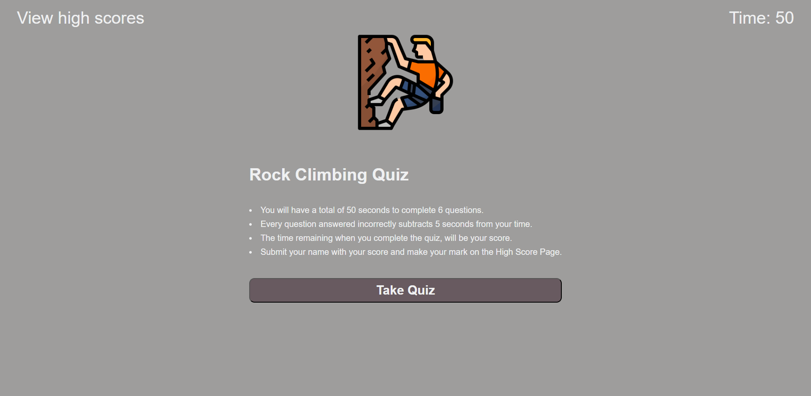

# Rock-Climbing-Quiz

## Description

This a Rock Climbing Quiz that, once started, has a timer that starts running. As questions are answered, they are presented with another question. If they answer wrong, time will be subtracted from the clock. Once the time reaches 0 or they answer all the questions, they will be presented with a score and an input to have their name and high score stored.

## Resources

[Deployed Link](https://zgibbs58.github.io/Rock-Climbing-Quiz/)

[Repo Link](https://github.com/Zgibbs58/Rock-Climbing-Quiz)

## Credits

Images used for quiz from flaticon.com
[Quiz Image Link](https://www.flaticon.com/free-icons/climbing)
[Quiz Image Link](https://www.flaticon.com/free-icons/summit)
[Quiz Image Link](https://www.flaticon.com/free-icons/climbing-wall)
[Quiz Image Link](https://www.flaticon.com/free-icons/miscellaneous)
[Quiz Image Link](https://www.flaticon.com/free-icons/climbing-shoes)
[Quiz Image Link](https://www.flaticon.com/free-icons/climber)
[Quiz Image Link](https://www.flaticon.com/free-icons/carabiner)
[Quiz Image Link](https://www.flaticon.com/free-icons/milestones)

## Screen 

